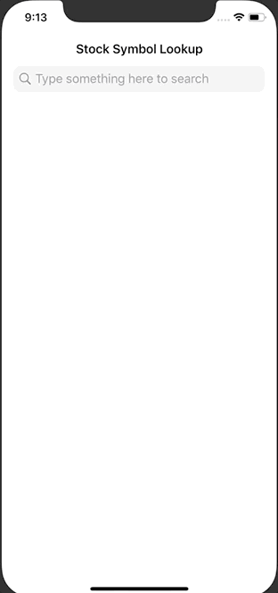

# Stock-Symbol-Lookup

This is a sample project that I've created to learn more about displaying a list of results using both UITableView and UISearchController.

# iOS
- Opening the app takes you to an empty screen with a search bar on top
- User can type in a companies name to see if they are publicly traded on the NYSE. If so, the results will be shown
- This is accomplished by making an API call to a Yahoo endpoint in which returns stock symbols for a given company name
- Tapping on a row will take the user to another screen in the nav controller. Though the same information is shown, I wanted to demonstrate how to pass data to another VC

# GIFs

Example of how this works:

